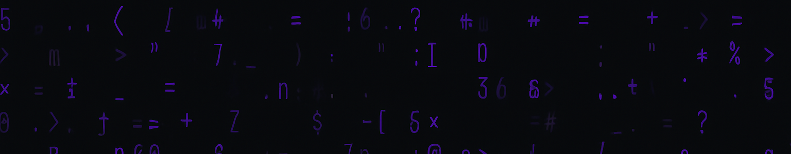

<!-- Custom Abstract Banner -->

<!-- Typing intro -->

<!-- Developer illustration -->
 

### ⚡ About Me
- 👨‍💻 Prefinal year ECE student passionate about software development  
- 🧱 Currently learning **Java & Data Structures**  
- 🤖 Exploring **IoT & Embedded Systems** for real-world problem solving  
- 💡 Enjoy learning new tech and turning ideas into practical solutions  
- 🌱 Trying to bridge the gap between **Electronics** and **Software**  
- 📬 Email: **saimiruthul@gmail.com**  
 

---

### 🚧 Currently Working On

  
  
  

### 📚 Currently Learning

  
  
  

### 🛠 Tools

  
  
  
  
  
  
  

---

## 🌐 Socials

  
  

## 🧠 Languages

  
  
  

---

